# AI-Based Smart Energy Saver & Intelligent Appliance-Level Energy Management System

An enterprise-grade, commercial prototype of an AI-powered energy management platform. The system monitors appliance-level electricity consumption, analyzes 6 months of historical energy patterns, predicts future demand using machine learning, detects abnormal usage and potential vacancy wastage, estimates tiered slab electricity bills, and verifies energy savings upon automatic virtual control.

> **SIMULATION MODE**: Built as a software-only intelligent virtual environment. Runs with realistic electrical telemetry (voltage, current, power factor, power, energy, ambient temperature, occupancy, light lux) without requiring physical ESP32/Arduino hardware, while maintaining 100% architectural compatibility for future IoT hardware drops.

---

## System Architecture

```mermaid
graph TD
    subgraph Virtual_Environment [Virtual Sensor & Appliance Engine]
        Ticker[Live Telemetry Ticker]
        Relays[Virtual Relays ON/OFF]
        EnvSim[Thermal & Occupancy Simulator]
    end

    subgraph Backend_FastAPI [FastAPI REST Service - Port 8000]
        API[REST Endpoints /api/*]
        MVE[Savings M&V Verification Engine]
        SeedGen[6-Month Consistent Data Generator]
    end

    subgraph AI_Intelligence [AI & Machine Learning Suite]
        Forecaster[ML Forecaster: 24h Diurnal, 7d, Month-End]
        IsolationForest[Isolation Forest Anomaly Detector]
        WastageEngine[Rule + ML Hybrid Wastage Detector]
        NLGenerator[Dynamic Monthly Natural Language Explainer]
        Recommender[Actionable Recommendation Engine]
    end

    subgraph Database_Layer [SQLite - Strict Mathematical Consistency]
        DB[(energy_system.db)]
        AppTbl[Appliances & Rooms]
        TelemetryTbl[15-min Telemetry & Daily Rollups]
        MonthlyTbl[Monthly Summaries & Budgets]
        LedgerTbl[Verified Savings & Wastage Events]
    end

    subgraph Frontend_UI [Modern React 18 + Vite + Tailwind CSS]
        Dash[Command Center Dashboard]
        AppView[Appliance Deep-Dive Telemetry]
        CompareView[Two-Month Comparative Analytics]
        WhatIf[What-If Interactive Simulator]
        AuditReport[Monthly Report & CSV Exporter]
        SimDrawer[Live Scenario Control Drawer]
    end

    Virtual_Environment --> Backend_FastAPI
    Backend_FastAPI --> Database_Layer
    Database_Layer --> AI_Intelligence
    AI_Intelligence --> Backend_FastAPI
    Backend_FastAPI --> Frontend_UI
    Frontend_UI --> Virtual_Environment
```



---

## Key Features & Capabilities

1. **Mathematical Data Consistency Guarantee**:
   $$\sum \text{Appliance Energy} = \text{Room Energy} \implies \sum \text{Room Energy} = \text{Household Total}$$
   All charts, KPI cards, and database ledgers derive from the exact same normalized SQLite schema.
2. **Multi-Month Comparative Analytics & Dynamic AI Natural Language Explanation**:
   - Compare any two months (e.g. August vs September).
   - Generates contextual natural language insights analyzing load surges, HVAC ambient temperature deltas, and top efficiency performers directly from data.
3. **Appliance-Level Deep Dive & Virtual Relays**:
   - 13 virtual appliances across Living Room, Master Bedroom, Kitchen, and Utility Area.
   - Interactive ON/OFF virtual relay switching with instant grid recalculation.
   - 24-hour telemetry curve, baseline deviation, and efficiency ratings.
4. **Machine Learning Forecaster**:
   - 24-hour hourly diurnal load curve with 90% confidence intervals.
   - 7-day daily forecast.
   - Month-end projected consumption vs configured Monthly Energy Target (260 kWh).
5. **Isolation Forest Anomaly Detection**:
   - Identifies degraded compressors, mechanical drag, and out-of-distribution loads.
   - Categorized by severity (`INFO`, `LOW`, `MEDIUM`, `HIGH`).
6. **Energy Wastage Detection & Auto-Mitigation**:
   - Sensor fusion detects when room occupancy is 0 while loads remain active (>15 min threshold).
   - "Apply Smart Saving" trigger auto-shuts virtual loads and records verified savings.
7. **Measurement & Verification (M&V) Savings Ledger**:
   - Strict differentiation between *Actual Saved Energy* and *Theoretical Potential*.
   - Records $\Delta P = P_{\text{before}} - P_{\text{after}}$, kWh saved, and ₹ saved.
8. **Interactive What-If Energy Simulator**:
   - Sliders for AC runtime reduction (0 to 5 hrs/day), thermostat setpoint adjustments (+1°C to +4°C), and equipment upgrades (BLDC fans, inverter pumps).
   - Instant live calculation of monthly kWh, ₹ saved, annualized savings, and avoided CO₂.
9. **Progressive Slab Tariff Billing Estimator**:
   - Indian utility tiered slab billing (0-100, 101-200, 201-400, >400 units) plus fixed demand charges.
10. **Automated Presentation & Demo Tour**:
    - Step-by-step guided evaluation tour covering all 12 platform capabilities.
    - Pre-packaged scenario triggers (Normal Day, Empty Room, High AC Anomaly, Target Surge, Auto Smart Saving).

---

## Technology Stack

- **Frontend**: React 18, TypeScript, Vite, Tailwind CSS, Recharts, Lucide React.
- **Backend**: Python 3.14+, FastAPI, Uvicorn, SQLite3 (WAL mode), Pydantic v2.
- **AI/ML**: Scikit-learn (RandomForestRegressor, IsolationForest), NumPy, Pandas, Scipy.

---

## Installation & Running Locally

### Prerequisites
- Python 3.10+ (Tested on Python 3.14.2)
- Node.js 18+ and npm

### 1. Backend Setup & Startup
```powershell
# Navigate to backend directory
cd backend

# Install dependencies
python -m pip install -r requirements.txt

# Run automated tests to verify mathematical consistency & ML models
python -m tests.test_energy_system

# Launch FastAPI server on port 8000
python -m app.main
```
The backend API is now running at: `http://127.0.0.1:8000` (Swagger docs at `/docs`).

### 2. Frontend Setup & Startup
```powershell
# Open a new terminal and navigate to frontend directory
cd frontend

# Install npm packages
npm install

# Start Vite dev server on port 5173
npm run dev
```
Open your browser at: **`http://localhost:5173`**

---

## Demonstration Script for Evaluators & Judges

Follow this exact demonstration workflow:

1. **Step 1 - Executive Dashboard (`/`)**:
   - View top KPI cards: Today's energy, Month-to-date energy, Estimated Bill, Energy Saved, Peak Power, Active loads.
   - Note the **`SIMULATION MODE`** badge and monthly target progress bar.
   - Toggle chart granularity: Hourly $\rightarrow$ Daily $\rightarrow$ Weekly $\rightarrow$ Monthly.
2. **Step 2 - Appliance Management (`/appliances`)**:
   - Filter appliances by Category (HVAC, Motor, Lighting, Kitchen).
   - Click on **Living Room AC (1.5 Ton)**: inspect rated power (1500W), baseline (1200W), 24h curve, and toggle the Virtual Relay switch.
3. **Step 3 - Month Comparison (`/comparison`)**:
   - Select **August 2026** vs **September 2026**.
   - Review the dynamically generated **AI Explanation of Monthly Change** explaining the exact numerical deltas.
4. **Step 4 - Trigger "Empty Room Wastage" Demo**:
   - Click **`Sim Controls`** in the top header.
   - Select **Scenario 2: Empty Room Wastage**.
   - Notice Living Room occupancy drops to 0 while lights & fan remain ON.
5. **Step 5 - Wastage Detection & Auto-Mitigation (`/wastage`)**:
   - Observe the newly flagged incident with duration and wasted cost.
   - Click **`Apply Smart Saving`**.
   - System auto-shuts the virtual load and confirms energy reduction.
6. **Step 6 - Savings Verification Ledger (`/savings`)**:
   - Inspect the cryptographically logged audit row with $P_{\text{before}}$, $P_{\text{after}}$, $\Delta P$, verified kWh saved, and ₹ saved.
7. **Step 7 - AI Anomaly Detection (`/ai-insights`)**:
   - Review Isolation Forest detection events with severity tags (`HIGH`, `MEDIUM`, `LOW`).
8. **Step 8 - Interactive What-If Simulator (`/what-if`)**:
   - Drag the **Reduce AC Runtime** slider to `2.0 hrs/day`.
   - Check **Upgrade Fans to BLDC**.
   - Watch the live recalculated output showing monthly and annual savings.
9. **Step 9 - Reports & CSV Export (`/reports`)**:
   - View the formal monthly audit report.
   - Click **`Export CSV`** to download the structured spreadsheet.

---

## REST API Overview

| Endpoint | Method | Description |
| :--- | :---: | :--- |
| `/api/dashboard` | `GET` | Aggregated dashboard KPIs, hourly trends, appliance breakdown, and sensor states |
| `/api/appliances` | `GET` | List of all 13 appliances with live power, monthly energy, and efficiency status |
| `/api/appliances/{id}` | `GET` | Deep-dive telemetry with 24-hour power readings and baseline comparisons |
| `/api/appliances/{id}/toggle`| `POST` | Toggle Virtual Relay state (ON/OFF) with immediate power recalculation |
| `/api/appliances/{id}/mode` | `POST` | Update operating mode (`MANUAL`, `SMART`, `RECOMMENDATION`) |
| `/api/energy/chart` | `GET` | Switchable granularity time-series (`hourly`, `daily`, `weekly`, `monthly`) |
| `/api/energy/comparison` | `GET` | Two-month side-by-side comparison with dynamic AI explanation generator |
| `/api/energy/savings` | `GET` | Measurement & Verification (M&V) verified savings history |
| `/api/energy/tariff-bill` | `GET` | Tiered slab electricity bill estimator |
| `/api/ai/forecast` | `GET` | ML 24h curve, 7d projections, and month-end target tracking |
| `/api/ai/anomalies` | `GET` | Unsupervised Isolation Forest anomaly detection log |
| `/api/ai/wastage` | `GET` | Vacancy wastage incidents log |
| `/api/ai/wastage/{id}/resolve`| `POST` | Auto-shut load and record verified savings |
| `/api/ai/what-if` | `POST` | Interactive scenario simulator (AC hours, setpoint, retrofits) |
| `/api/simulation/scenario` | `POST` | Trigger demonstration scenarios on demand |
| `/api/reports/monthly` | `GET` | Formal monthly audit report payload |
| `/api/reports/export-csv` | `GET` | Downloadable CSV export of appliance energy consumption |

---

## Future Hardware Integration Architecture

The platform was intentionally architected so that physical IoT hardware can be connected in Phase 2 without rewriting backend or frontend logic:

```
[Physical Appliances] 
       │
[CT Clamps / PZEM-004T / DHT22 / PIR Motion Sensors]
       │
[ESP32 Microcontroller] (Calculates V, I, P, kWh, Temp, Occ)
       │ (JSON over MQTT / HTTP POST)
[FastAPI Gateway /api/telemetry/ingest]
       │
[SQLite / TimescaleDB]
       │
[AI Engines & Web Dashboard]
```

Payload emitted by the software simulator matches future ESP32 payloads:
```json
{
  "timestamp": "2026-09-19T14:30:00",
  "appliance_id": "living_ac",
  "voltage_v": 230.4,
  "current_a": 5.22,
  "power_w": 1202.6,
  "energy_kwh": 0.3006,
  "temperature_c": 26.2,
  "occupancy": 1,
  "light_lux": 380.0,
  "status": "ON"
}
```

---

## Known Limitations

- **Software-Only Environment**: Current telemetry is driven by behavioral diurnal simulation and thermal math models rather than physical high-voltage mains.
- **Single SQLite Database**: Suitable for single-household and prototype demonstrations up to 100,000 readings. For commercial city-wide rollouts, migration to PostgreSQL with TimescaleDB is recommended.
- **Relay Actuation**: Appliance toggling in this prototype actuates virtual software relays; physical relay switching requires future ESP32 GPIO integration.
